# Design specification: mobile rebuild with an editorial financial-services visual system

**Source:** [Public reference website](https://www.lincolnfinancial.com/public/individuals)  
**Captured:** October 4, 2026  
**Purpose:** Guide a direct mobile UI/UX rebuild that removes visual clutter and uses the reference's restrained editorial design. Retain detailed source measurements for desktop/marketing templates, with explicit mobile product overrides in Section 0.

> **Identity exclusion is mandatory.** Do not use the Lincoln name, Lincoln Financial / Lincoln Financial Group names, Lincoln National Corporation name, portrait or silhouette, logo, monogram, taglines, product trademarks, campaign names, proprietary illustrations, badges, branded photography, or source marketing/legal copy in a new site. Screenshots in this package contain the original identity solely as research evidence. They are not production assets. Use a new organization name, original logo, independently written copy, and owned or separately licensed visuals. Preserve geometry and hierarchy; replace identity and content.

## Contents

0. [Mobile rebuild brief: use this section first](#0-mobile-rebuild-brief-use-this-section-first)
1. [Evidence, scope, and confidence](#1-evidence-scope-and-confidence)
2. [Visual direction and fidelity rules](#2-visual-direction-and-fidelity-rules)
3. [Design tokens](#3-design-tokens)
4. [Grid, containers, and spacing](#4-grid-containers-and-spacing)
5. [Responsive system](#5-responsive-system)
6. [Header, navigation, and breadcrumbs](#6-header-navigation-and-breadcrumbs)
7. [Hero families](#7-hero-families)
8. [Quick-action strips](#8-quick-action-strips)
9. [Cards, editorial content, and callouts](#9-cards-editorial-content-and-callouts)
10. [Tools directory and category selection](#10-tools-directory-and-category-selection)
11. [Support, forms, and decision trees](#11-support-forms-and-decision-trees)
12. [Footer](#12-footer)
13. [Page blueprints](#13-page-blueprints)
14. [Interaction and accessibility](#14-interaction-and-accessibility)
15. [Asset replacement and content rules](#15-asset-replacement-and-content-rules)
16. [Implementation handoff](#16-implementation-handoff)
17. [Visual acceptance criteria](#17-visual-acceptance-criteria)
18. [Screenshot and evidence index](#18-screenshot-and-evidence-index)

## 0. Mobile rebuild brief: use this section first

**The implementation target is a clean mobile product UI, using the reference's visual discipline.** The measured corporate website below is the visual source, not a requirement to reproduce its entire marketing page inside an app. On mobile, prioritize the person's task, readable content, a meaningful result, and one obvious next action.

This section takes precedence over source-faithful measurements when rebuilding a dense existing product. Keep the reference's burgundy, lightweight serif page headings, restrained sans-serif text, square controls, thin borders, generous spacing, and calm composition. Change the parts that would perpetuate clutter: small body text, lengthy legal stacks, oversized marketing heroes inside workflows, and repeated status decorations.

### 0.1 Non-negotiable cleanup rules

1. **No decorative verification badges.** Remove repeated “Verified,” “Proved,” “AI checked,” confidence scores, shields, checkmark pills, and implementation reassurance from ordinary user-facing cards. Do not expose internal validation as a visual ornament.
2. **No random small text.** Main paragraphs, form inputs, action labels, and decision explanations are at least 16px. Secondary useful information is 14px minimum.12px is reserved for genuinely incidental legal/reference information, never a required instruction, cost qualification, action, or form label.
3. **No em dashes in UI copy.** Use a period, a shorter sentence, a label/value row, or a separate paragraph. Do not replace every em dash with another separator and preserve the same overloaded sentence.
4. **One dominant action per screen state.** Other actions are secondary links or a clearly grouped action list. Do not render five equal-weight CTA cards before the primary task.
5. **One explanation per fact.** Remove duplicate warnings, repeated estimates disclaimers, and multiple sentences restating the same calculation. Keep information once, where it affects a decision.
6. **No feature inventory as the default screen.** Organize around the user's next step. Internal model names, milliseconds, confidence percentages, hashes, schema status, trace IDs, proof internals, and integration details belong in a developer/admin view.
7. **No pill soup.** Replace clusters of status chips with one meaningful plain-language status line, if a status is actually needed. Use ordinary text labels and a restrained divider.
8. **Do not shrink content to make it fit.** Reflow, stack, shorten, or progressively disclose. Never fix mobile density by reducing font size or hiding a critical column in a horizontal scroller.
9. **Every visible control must complete a meaningful action.** Remove dead “verify” links, ornamental buttons, empty controls, and vague “learn more” actions with no useful destination.
10. **Keep consequential uncertainty clear.** Removing visual clutter must not turn an estimate into a promised bill, obscure sample data, conceal missing information, or remove an actual confirmation step. Make the qualification concise, readable, and adjacent to the relevant result.

### 0.2 Mobile type, spacing, and controls

These are **intentional rebuild overrides**, not source measurements:

| Role | Mobile rebuild requirement |
|---|---|
| Page title | Lightweight licensed serif,32/38; one or two lines. Use 36/42 only for a short landing title. |
| Main result / money amount | Sans-serif,32/38 medium; tabular numbers; label immediately adjacent. |
| Section title | Sans-serif,22/28 medium. |
| Card title | Sans-serif,20/26 medium. |
| Body, form label, input, primary action |16/24; input text never below 16px. |
| Useful secondary detail |14/20; enough contrast to read without zoom. |
| Incidental legal/reference text |12/18 minimum; absent from the main task unless needed. |
| Page inset |20px at 390px;16px at 320–375px. |
| Main section separation |32px; use 40px for a major context change. |
| Card/section inner padding |20px;16px on the narrowest screen. |
| Label/value row gap |12px vertical; align values clearly. |
| Main button |At least 48px high; square or subtle 2px radius; full width when it is the next action. |
| Other touch targets |At least 48 ×48px, even when the visible icon is smaller. |
| Form field |At least 48px high,16px text, visible label, readable error beneath. |
| Header |Compact 64–70px, own identity, screen context, one navigation affordance. |

Avoid mixing six font sizes inside one card. A usual card needs a title, body/rows, and at most one secondary text role. Use whitespace to create hierarchy, not tiny uppercase subtitles above every value.

Use a white main surface, burgundy primary action/link, dark readable text, and fine gray dividers. Orange appears sparingly in functional icons or reference-inspired decoration. Remove gratuitous gradients, color-coded miniature badges, and nested pale panels.

### 0.3 Screen anatomy

The first mobile screen should answer: **Where am I? What matters now? What can I do next?**

Preferred order for a result-oriented screen:

1. Compact own-brand header / navigation.
2. Short page title and one sentence only if the title needs context.
3. Main result or current task, with its time period/scope clearly attached.
4. The single qualification that changes how the result should be understood.
5. Primary action with a concrete verb.
6. A small set of supporting details, followed by optional deeper explanation.

For a form-oriented screen, the task/input is the main result region. For an empty state, use a direct explanation and the action that creates real data. Do not show an invented recommendation or default persona as though it belongs to the user.

A mobile application does not need the corporate reference's full photo hero, six-action strip, five-column directory, or long legal footer on every screen. Borrow their typography, alignment, borders, and spacing. Keep marketing composition for actual marketing/landing pages.

### 0.4 Progressive disclosure without evasiveness

Show decision-critical content immediately: what an amount represents, whose plan/date it uses, whether data is sample, and any missing input that materially changes the result. Put calculation steps, source documents, detailed assumptions, and technical provenance behind a clearly labeled **Cost breakdown**, **Estimate details**, or **Source documents** control.

An optional details control is a normal 48px touch target with 14–16px readable text. It is not a tiny “verify” word beside every amount. When a source is missing, explain exactly what is missing and give a concrete action. Do not bury that fact in the details drawer.

Keep one consistent sample-data notice near the top of a sample session. Do not repeat a demo badge in every card. Keep saving/failure states when they describe a real workflow outcome. “Saved” should mean persisted; “Sent” should mean actually sent. Removing status clutter does not justify removing useful feedback.

### 0.5 Rewrite rules and examples

Write like a helpful product, not an AI explaining its own reliability. Use ordinary nouns and verbs. Remove filler introductions, grand promises, unnecessary caveats, rhetorical contrasts, and parenthetical tangents. Prefer a short heading and a direct sentence.

The examples below are **proposed copy patterns**, not quoted source strings or verified product outcomes. Values shown in a real rebuild must come from the existing calculation/data layer.

| Cluttered pattern | Replacement pattern |
|---|---|
| “AI verified • proved • confidence 98%” next to every amount | Remove. Offer one optional **Cost breakdown** action when useful. |
| “Your estimate — based on your plan — verify with your provider” | Heading **Estimated cost**. Then one readable, specific qualification. |
| “Verify” on each procedure | If a real missing fact exists: **Confirm the dentist's fee** beside that fact, with a useful action. Otherwise remove. |
| Long paragraph explaining a four-step payment waterfall | Four readable label/value rows: **Dentist's fee**, **Plan discount**, **Plan pays**, **You pay**. |
| “We leverage AI to confidently optimize…” | State the outcome: **Compare dates and estimated costs.** |
| “Engine 23ms / model / proof / CDT code” across a patient card | Keep human-readable treatment name. Put identifiers and diagnostics in professional/admin details. |
| Small repeated “not a guarantee” notes below every card | One concise qualification beside the main estimate; include a specific exception only when it changes a particular item. |
| Three equal filled buttons plus small links | One filled next action. One outline alternative only if it is a real competing choice. |
| “Unlock your personalized journey…” empty state | **Add your treatment plan to see an estimate.** |

Do not replace all uncertainty with bland reassurance. If the insurer allowance is unknown, say that in one readable sentence and show the resulting assumption. If a price is sample data, label it clearly. Treat these as information, not warning-themed decoration.

### 0.6 Applying this to the current Ting codebase

This mapping comes from existing source files and the local mobile review, not a new live app audit. **This deliverable changes the design specification only.** Preserve Ting's own identity and use independently owned visuals; exclude the reference company's identity.

| Existing area | Rebuild direction |
|---|---|
| `src/components/AppShell.tsx` / `TopBar.tsx` | Put member tasks first. Use a small, consistent mobile navigation set. Move employer/insurer/admin/demo destinations out of the primary member task flow. |
| `src/pages/Dashboard.tsx` | Lead with one relevant recommendation or next step, followed by concise supporting amounts. Remove the wall of equally weighted feature cards. |
| `src/pages/Treatment.tsx` | Order the screen as selected treatment → cost → timing choice → next action. Keep essential missing-information notices readable. |
| `src/components/IntakeBox.tsx` |Use 16px inputs/labels. Replace miniature example pills with a small number of readable suggestions. Hide technical codes/confidence metadata from the member view. Ask only meaningful questions. |
| `src/components/ProcedureList.tsx` / `Waterfall.tsx` |Use readable procedure rows and a selected-item detail view with an explicit relation to the tapped item. Prefer aligned cost rows over repetitive prose. |
| `src/components/Timeline.tsx` / `ScheduleTabs.tsx` | Provide a tap-based date/choice control. Dragging can remain optional; no precise dragging requirement on phone. Keep selected schedule and export consistent. |
| `src/components/VerifiedBadge.tsx` / `AuditDrawer.tsx` | Remove recurring badge presentation from ordinary member cards. Keep real technical evidence in an optional admin/developer view. Do not disable underlying validation. |
| `src/components/PricingNote.tsx` / `EstimateFooter.tsx` | Consolidate shared explanation; elevate a material assumption to 14–16px beside the estimate it affects. Do not delete provenance needed to understand sample/unknown fees. |
| `src/components/EnrollmentCard.tsx` | Present recommendation, plan/year, main cost, and one primary next action. Move calculation context into details; keep export/share tied to the shown recommendation. |
| `src/pages/Dentists.tsx` / `DentistList.tsx` |Readable stacked dentist rows with concrete next actions. Do not imply booking or confirmed prices if the data cannot support them. |

Keep the existing engine as the source of amounts. A UI rebuild must not silently change calculation logic, replace missing data with fabricated values, or present an unsupported outcome as completed. Behavioral defects documented in [the existing mobile review](../mobile-ux-review.md) need separate fixes when implementation begins; prettier components alone do not resolve them.

### 0.7 Direct implementation prompt

Use this brief with the rest of this file:

> Rebuild the existing member-facing UI for mobile first using this design.md. Preserve application calculations and useful functionality. Use the reference's restrained burgundy, light serif page headings, Roboto-like readable body type, square controls, thin gray dividers, and generous whitespace. Apply Section 0 mobile overrides rather than copying the corporate marketing shell into workflows. Remove decorative verification/confidence badges, technical reassurance, em dashes, repeated caveats, miniature labels, and competing card actions. Show one primary task/result and next action in each screen state. Keep material uncertainty and sample-data context concise, readable, and adjacent to the relevant amount. Reflow tables and timelines into touch-friendly layouts; provide 48px targets and 16px inputs. Use Ting's own identity and original/licensed assets. Do not include the reference namesake, logos, marks, source copy, photographs, or proprietary artwork. Validate at 320,375,390,430,768px and at 200% text zoom. Report any unimplemented workflow separately; do not imply it works.

### 0.8 Mobile rebuild acceptance gate

- [ ] At 390 ×844, a person can identify the task/result and the next action without reading a stack of small explanatory cards.
- [ ] Main body, inputs, action labels, and required instructions are 16px or larger; useful secondary information is 14px or larger.
- [ ] Every tap target is at least 48px; keyboard/zoom states retain usable controls.
- [ ] No member screen contains decorative “Verified,” “Proved,” confidence, model, trace, or performance badges.
- [ ] No em dash appears in new user-facing copy. Real source/document quotations can remain verbatim inside optional reference views.
- [ ] No repeated disclaimer appears in every card; material qualifications remain visible once in the relevant place.
- [ ] No essential action or amount requires hover, horizontal scavenging, precision dragging, or tiny text.
- [ ] The screen has one dominant CTA, clear loading/error/empty/success states, and no invented success.
- [ ] Removing visual verification chrome has not removed underlying validation or meaningful confirmation workflows.
- [ ] Source identity and research screenshots remain excluded from production.


## 1. Evidence, scope, and confidence

This is a deep, representative crawl of **16 public routes**, covering **24 measured page states** and **27 screenshots**. It includes three audience landing pages; six product families; a product detail page; a calculator directory and alternate selected category; customer support; an inquiry form; a claim decision tree and its next step; a company page; and a long campaign page. Responsive samples include **390px phone, 768px tablet, 1080px desktop, and 1935px wide desktop**.

The crawl discovered 263 unique HTTPS links and recorded 146 distinct image/asset URLs. These counts describe captured DOM content, not every possible route or all assets on the domain. The package is a design-system study, not a complete mirror, backend scrape, or archive of authenticated applications. No inquiry form or claim was submitted.

Evidence files:

- [Browsable screenshot gallery](index.html)
- [Capture manifest](crawl-manifest.json)
- [Discovered links](discovered-links.json)
- [Reference-only asset inventory](reference-asset-inventory.json)
- [Observed computed tokens](observed-tokens.json)
- [Neutral implementation tokens](tokens.json)
- [Original starter CSS](tokens.css)

Each measured page has a JSON record with URL, title, viewport, page height, links, element bounds, computed styles, and observed image sources, plus a rendered DOM text snapshot. The CSS inspection is retained as research evidence; **do not ship the source site's stylesheet or reference assets**. Fractional dimensions result from browser layout; round deliberately when implementing.

Use these confidence labels throughout:

| Label | Meaning |
|---|---|
| **Measured** | Read from rendered element bounds or computed styles at a captured viewport. |
| **Observed** | Visually evident or confirmed through a specific interaction. |
| **Recipe** | A new implementation recommendation that reproduces the measured visual system. |
| **Unverified** | A source behavior/state was not successfully captured. Do not claim exact reproduction. |

Pixel fidelity is assessed at matched viewport widths with equivalent text length and aspect ratios. New copy and replacement imagery will change wrapping, crop, and total page height. Exact headline type also depends on independently obtaining the proper font license. Do not promise an identical raster image after replacing identity-bearing assets.

## 2. Visual direction and fidelity rules

The reference feels like an established editorial institution: generous white space, a dark burgundy anchor color, fine gray outlines, large lightweight serif display text, straightforward sans-serif body copy, orange line icons, and broad photographic heroes. The page architecture is calm and rectangular. Cards gain dimension through overlapping white copy panels rather than rounded corners or floating shadows.

Preserve these defining relationships:

1. A compact two-level desktop header sits above a hero wider than the main content container.
2. Display headings are thin serif; navigation, body text, labels, and most card headings are sans-serif.
3. Hero copy is substantial but occupies a defined half or third of the hero.
4. A white quick-action strip crosses the hero's bottom edge by 40px on wide desktop.
5. Promotional card copy is inset 20px from the photograph's sides and overlaps it vertically by 20px.
6. Borders are fine and square. Ordinary cards have no visible shadow.
7. Desktop card rows usually have three columns and 30px gutters.
8. At tablet/phone widths the system becomes a long, single-column page, including the quick actions and promotional cards.
9. The footer is a light gray directory followed by a substantial dark gray legal area.
10. Orange is used for modest icons and geometric accents, not large general-purpose CTA backgrounds.

Do not substitute a generic modern SaaS treatment: pill buttons, highly rounded cards, saturated gradients, thick shadows, giant bold headings, dense masonry, and glass effects would materially change the reference.

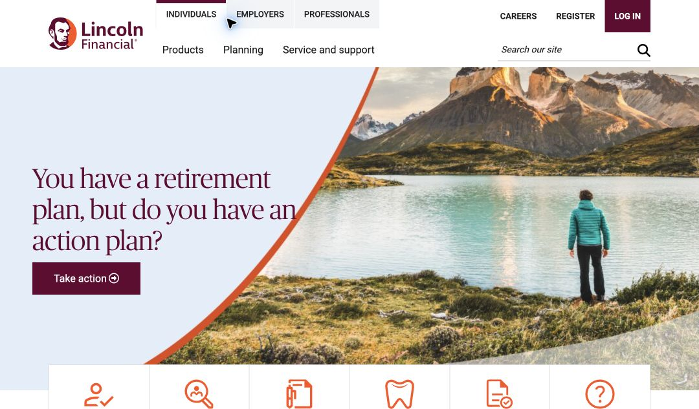

*Reference capture at 1080 × 633. Original identity is visible for inspection only. Notice the thin navigation, large serif heading, square CTA, broad photo, and overlapping quick-action strip.*

## 3. Design tokens

### 3.1 Color

| Semantic token | Value | Role / confidence |
|---|---|---|
| `primary` | `#650030` | **Measured.** Burgundy buttons, links, selected indicators, hero panels, navigation emphasis. |
| `text` | `#222222` | **Measured.** Body copy and most basic labels. |
| `heading-muted` | `#37424A` | **Measured.** Several general display headings and subdued dark text. |
| `text-secondary` | `#5A5A5A` | **Measured.** Secondary text and form outlines. Also the dark footer surface. |
| `surface` | `#FFFFFF` | **Measured.** Page, cards, action strip, form fields. |
| `surface-muted` | `#F2F4F6` | **Measured.** Footer directory, inactive category tiles, hero fallback. |
| `border` | `#DCDEE0` | **Measured.** Card outlines and separators. |
| `icon-orange` | `#FF4F17` | **Observed asset value.** Extracted from an orange SVG icon; obtain/redraw your own icon set. |
| `accent-orange` | `#FF5D0F` | **Observed CSS value.** Some decorative orange treatments. Not interchangeable with every orange pixel inside a photo/composite. |
| `callout-blue` | `#004594` | **Measured.** Product-detail sidebar callout. |
| `focus` | `#036D9B` | **Observed CSS value.** Dotted focus treatment. |
| `on-primary` / `on-dark` | `#FFFFFF` | **Measured.** Text on burgundy and dark footer. |

The pale blue seen behind the homepage photo is part of the composite artwork, not a universal computed surface token. An approximate art-direction swatch is `#E5EDF7`; create a new visual and tune it against screenshots. The source also contains additional garnet/red/yellow decorative shades. Treat the stripe artwork as a separate decorative asset, not a mandatory semantic palette for every component.

Keep the observed primary burgundy in a reference-faithful prototype unless the new identity requires another color. Any change to primary color changes the reference's visual identity; record that as an intentional variation. Color alone does not authorize reuse of logos, marks, or proprietary art.

### 3.2 Typography

The reference declares **PublicoBannerLight** for serif display text and **Roboto** for sans-serif text. The displayed serif is central to the look. Do not download or hotlink its font file from the source site. Use Publico only with an independent license; otherwise use an appropriately licensed lightweight editorial serif and record the resulting metric differences. Georgia is a temporary fallback, not an exact match.

| Role | Desktop size / line-height / weight | Phone behavior | Family |
|---|---|---|---|
| Hero display heading | 42 / 48 / 300 | Homepage and tools hero **retain 42 / 48** at 390px | Display serif |
| General H1 rule | 42 / 48 / 300 | Base stylesheet provides 36 / 45 below 768px; component overrides can supersede it | Display serif |
| Editorial serif H2 | 30 / 32 / 300 | Keep component-specific wrapping; do not globally scale every H2 | Display serif |
| Promotional card H2 | 24 / 32 / 300 | 22 / 27 / 300 | Roboto |
| Standard H3 | 20 / 28 / 500 | Base small-screen rule 18 / 22; some components retain 20 / 28 | Roboto |
| Quick-action title | 20 / 32 / 500 | 20 / 32 / 500 | Roboto |
| Body | 16 / 24 / 400 | 15 / 22.5 / 400 below 768px | Roboto |
| Stripe hero introduction | 22px; rendered paragraph 24px line-height | 20px; rendered paragraph 24px line-height | Roboto |
| Audience tabs / top utilities | 13 / 24 / 500 | Simplified utility header replaces tabs | Roboto |
| Desktop search field | 14 / 21 / 400 | Hidden in compact header | Roboto |
| Footer column heading | 16 / 16 / 500 | Same hierarchy in stacked sections | Roboto |
| Legal paragraph | 14 / 20 / 400 | Same compact text; wraps to many more lines | Roboto |

The stripe intro wrapper computes 33px desktop / 30px mobile line-height, but its nested paragraph renders at 24px. Match the visible paragraph rather than blindly inheriting the wrapper's line-height. Computed styles include layered overrides; `observed-tokens.json` records variations rather than one assumed global rule.

Headings use normal letter spacing. Do not add decorative tracking to body text or display headings. Uppercase is reserved for small utilities, some CTA labels, and small section labels. Keep normal mixed case elsewhere.

**Copy-length recipe:** Draft hero headings to produce two or three lines on wide desktop and up to four on phone. Promotional headings should normally fit two or three lines. Write body copy in short paragraphs. Match semantic density and line count with new wording, never verbatim source copy.

### 3.3 Borders, elevation, radii, and motion

| Property | Reference treatment |
|---|---|
| General radius | 0px: hero panels, cards, most buttons, normal form fields |
| Card outline | 1px `#DCDEE0` |
| Form field outline | 2px `#5A5A5A` |
| Support search radius | 10px, a component-specific exception |
| Support headline backing | 8px radius, semi-opaque white |
| Card elevation | None |
| Dropdown elevation | Subtle shadow with fine gray boundary |
| Focus | Visible dotted outline in captured/source rules; recipe uses 2px dotted `#036D9B` |
| Link transition | Source CSS includes 0.3s transition |
| Initial page reveal | Source CSS includes a 0.8s opacity animation after 0.5s delay; timing not interactively measured |

Do not add page-wide blankness while waiting for animation in a new implementation. A restrained reveal can be opt-in and must respect reduced-motion preferences. Animation duration is not a prerequisite for layout fidelity.

## 4. Grid, containers, and spacing

### 4.1 Container widths

The source uses a Bootstrap-like 12-column grid with custom spacing and a wider top breakpoint. Framework choice is optional; dimensions are the important part.

| Viewport minimum | Outer content container max-width | Inner width after 15px left/right padding |
|---|---:|---:|
| Below 576px | 100% | viewport − 30px |
| 576px | 540px | 510px |
| 768px | 720px | 690px |
| 992px | 960px | 930px |
| 1200px | 1140px | 1110px |
| 1400px | 1366px | 1336px |

The hero is a separate centered container: full width at smaller widths, max **1210px** from 1200px, and max **1436px** from 1400px. At these desktop breakpoints it is 70px wider than the main outer container.

At a 1935px viewport:

- Hero left = `(1935 − 1436) / 2 = 249.5px`.
- Main outer container left = `(1935 − 1366) / 2 = 284.5px`.
- Main content left after padding = `299.5px`.
- Half-width hero copy left padding is 50px, also giving a text edge at `299.5px`.
- Main content right edge = `1635.5px`.

This coordinated alignment is a major part of the look. Do not replace everything with a uniform 1200px container.

At 1080px the main container is 960px and hero spans the viewport. The hero copy still uses 50px padding, so its text edge is 50px while main content begins at 75px. This is an observed difference, not an error to normalize.

### 4.2 Columns and spacing

Use 30px horizontal grid gaps: 15px padding per column, with row gutters reconciled at the container edge. Three equal cards inside 1336px yield `(1336 − 60) / 3 = 425.33px` images. Two equal columns yield `(1336 − 30) / 2 = 653px`.

Frequently observed spacing units are **5, 10, 15, 20, 30, 40, 50, and 60px**. Use them by purpose:

| Distance | Typical use |
|---:|---|
| 5px | Small utility offset / active indicator |
| 10px | Title-to-body gap, category item gap, paired form field gap |
| 15px | Container gutter, compact card padding |
| 20px | Card inset/padding, mobile hero padding, editorial paragraph separation |
| 30px | Desktop column gap and ordinary section rhythm |
| 40px | Hero/action overlap, major content gap, desktop legal footer padding |
| 50px | Hero horizontal copy padding; light footer top padding |
| 60px | Larger editorial section separation |

Avoid collapsing vertical whitespace simply to make a page shorter. Footer start position is the outcome of correct section sizing and content, not a fixed page height.

## 5. Responsive system

**992px is the main composition breakpoint.** At 768px, the reference already uses a compact header and stacked cards. A two-column tablet promotion grid would diverge from the observed site.

| Component | Wide desktop ≥ 1400 | Desktop 992–1399 | Tablet 768–991 | Phone < 768 |
|---|---|---|---|---|
| Header | Two levels; 118px captured height | Two levels; 104px at 1080 | Compact 70px | Compact 70px |
| Main container | 1366px | 960 or 1140px by breakpoint | 720px | Fluid, 15px edges |
| Homepage hero | Text over left half of composite; 500px high | Same 500px structure | Photo above copy | Photo above copy |
| Homepage hero heading | 42 / 48 | 42 / 48 | 42 / 48 | 42 / 48 in captured hero |
| Quick actions | Horizontal equal-width cells | Horizontal cells | Stacked horizontal rows | Stacked horizontal rows |
| Promotional cards | Three columns | Three columns | One column | One column |
| Tools categories | Left quarter | Left quarter | Above cards | Above cards |
| Breadcrumbs | Visible | Visible | Hidden in sampled tools layout | Hidden in sampled tools layout |
| Footer directory | Five columns | Five columns | Stacked sections | Stacked sections |

Measured homepage phone geometry, 390 × 844:

- Header: y0–70.
- Photo: y70–270.7, approximately 200.7px high.
- Copy block begins y270.7; horizontal padding 20px.
- Heading width 350px; four lines at 42 / 48 in this capture.
- CTA height approximately 48.5px due to phone text metrics.
- Quick-action container begins around y617.2 and is 360px wide at x15.
- Six action rows are approximately 91px each.
- Card images are 360px wide; inset copy panels are 320px wide at x35.

Measured tablet geometry, 768 × 844:

- Header 70px.
- Photo height 400px, starting y70.
- Copy block starts y470, with 64px horizontal padding and 640px text width.
- Heading occupies two lines at 42 / 48.
- CTA begins around y596 and is 50px high.
- Quick actions start around y722; content width 690px within the 720px container.
- All six promotional cards remain individually stacked.

These hero photo heights come from responsive artwork/composition. Do not stretch a desktop background beneath mobile text; use a separate image region and a copy region.

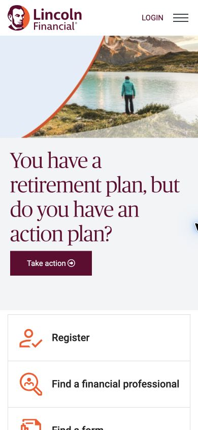

*390px reference: compact header, image first, serif copy beneath, then stacked action rows.*

## 6. Header, navigation, and breadcrumbs

### 6.1 Desktop header

Use a white header with two information levels inside the main container:

- A left identity slot approximately 146 × 50px at wide desktop. Install the new organization's own logo here.
- Upper audience navigation: three short uppercase audience labels, separated through space and active underline/edge treatment rather than large tabs.
- Upper right utility links and a filled burgundy login block.
- Lower navigation: a small set of top-level product/planning/support choices, plus search toward the right.
- Search is an understated 236 × 35px rectangular input with an adjacent search affordance.

At 1935px, the source identity slot begins x299.5, y34. The overall header is 118px high. At 1080px, compressed utility spacing reduces the header to 104px. Keep responsive spacing rather than force both to 118px.

### 6.2 Desktop dropdown

The product menu was opened and photographed. It is a compact white flyout below the lower navigation, approximately 320px wide, with a fine gray outline, subtle shadow, and small upward notch. It contains a vertical list of links, an internal separator, and a grouped subheading. The list is left aligned and spacious enough to read, with burgundy accents rather than a multi-column mega-menu.

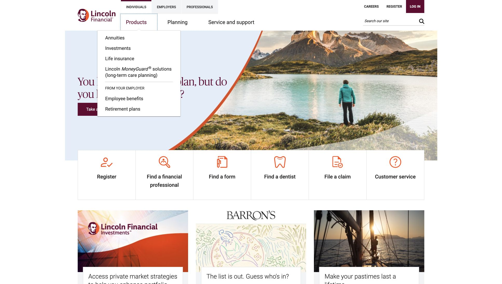

**Recipe:** Use a button with `aria-expanded` and a linked menu panel; open by click and keyboard, support Escape, and restore focus on close. Ensure pointer movement into the menu does not close it prematurely. These accessibility behaviors are recommendations; only the visible open state was captured.

### 6.3 Compact header

Below 992px, keep a 70px white bar: own logo at the left with approximately 15px edge space, a small uppercase login action, and a hamburger at the right. Audience tabs, desktop navigation, and desktop search are not visible in this state.

**Unverified:** The expanded mobile navigation panel was not successfully captured. Its exact drawer geometry, overlay, transition, and submenu structure are not specified as observed behavior. Implement an accessible compact menu that preserves the header's color, typography, and square controls, and mark it as a new design decision.

### 6.4 Breadcrumbs

Internal non-hero content pages and detail layouts show a subdued horizontal breadcrumb trail above the title/content. Use small sans-serif links, low-contrast separators, and generous breathing room before the main heading. Do not reproduce the original route names unless they are generic descriptions relevant to the new site. Hide or adapt them on compact layouts according to the sampled tools template.

Header stickiness was not systematically tested. The category-switch capture has the desktop header outside the visible viewport after scrolling, so do not assume a persistent sticky desktop bar.

## 7. Hero families

### 7.1 Homepage composite hero

**Measured desktop:** 1436 × 500px, immediately after the header. Left copy region is half-width, 718px, with `padding: 20px 50px`; vertically center the heading-plus-CTA group. Heading is 42 / 48 lightweight serif in burgundy. The captured heading spans 618px, two lines, and 96px height. CTA is approximately 167 × 50px with 12px vertical and 32px horizontal padding.

The source artwork combines a panoramic landscape, person, pale blue field, orange curve, and curved white lower edge. These details are baked into the artwork rather than separate measured DOM boxes. Create an original composite with similar broad proportions, subject placement on the right, open copy area on the left, and a soft curved transition. Do not reuse the photograph, source illustration, or any identity-bearing silhouette.

On compact layouts, photo precedes a white/light copy section. Preserve 42 / 48 hero typography rather than shrinking it to ordinary mobile H1 defaults.

### 7.2 Split product hero

A common product family uses a burgundy left panel approximately one third of the hero and a photo on the remaining two thirds. White serif headline and short white body copy sit within the panel. Examples include the annuity family and investment family. The photo is a warm lifestyle scene or restrained architectural photograph, depending on topic.

Variants:

- **Burgundy + photo:** institutional, high contrast.
- **White copy + photo:** workplace and employee benefit pages; darker text over white.
- **Burgundy + neutral bridge + photo:** the life insurance hero includes an additional middle color region/composite treatment.

Use the corresponding screenshot to select a variant; do not force every product into the homepage half-width copy composition. Keep 500px desktop height where observed, with topic-dependent copy wrapping.

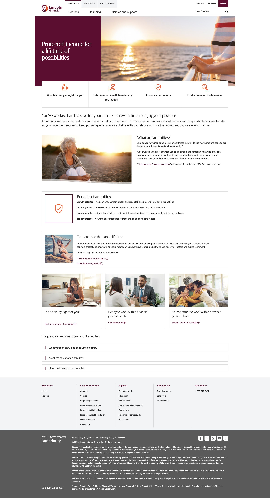

### 7.3 Inset editorial panel hero

The long-term planning page uses a 1436 × 420px hero. A white **360 × 360px** panel is inset 50px from the hero's left edge and 40px from its top. Internal padding is 20px. Its display heading is 42 / 48 and spans 320px. A compact burgundy corner/topic treatment sits toward the panel top.

Recreate the panel geometry with an original topic label or simple shape. Do not reproduce a source branded icon or mark in that corner. The background photo remains visible on the right and around the panel.

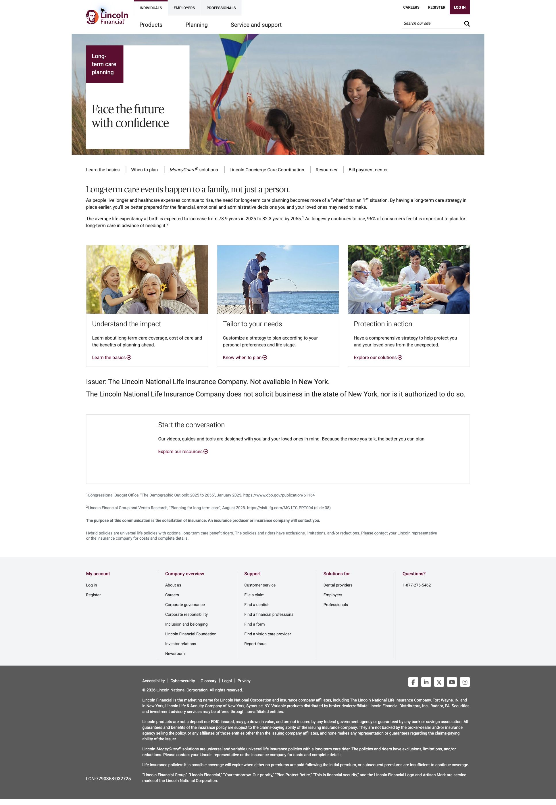

### 7.4 Stripe title hero

Tools and article/detail pages use a shallow burgundy title banner instead of a large lifestyle hero. At wide desktop the tools banner is **1436 × 188px**. Main title starts 50px from the hero's left edge and 40px from its top. Heading is white 42 / 48 serif; intro follows with roughly 20px separation. Narrow vertical warm-colored bands accent the far right.

At 390px, the tools banner is approximately 210px high, with heading x15/y90, width 340, two lines at 42 / 48. A narrow decorative strip remains at the right. Inner paragraph uses 20px text / 24px rendered lines.

**Recipe:** Use original CSS stripes or original SVG with approximately the same placement and width; no downloaded source asset. Keep the strip decorative (`aria-hidden`). Let height grow for different copy rather than clip text to 210px.

### 7.5 Campaign hero

The campaign page uses a panoramic photographic scene with a tall white inset copy panel near the left. The headline is short and serif; the page below is much longer than a standard product hub. Match the quiet panel framing and broad outdoor photo direction with new campaign wording and imagery. The original campaign title and slogans must not be used.

## 8. Quick-action strips

### 8.1 Desktop geometry

The homepage has six equal cells in a white bordered strip. Its inner visible width is 1336px, cells approximately 222.5px wide, total height 192px. It begins at y578 while the hero ends at y618, giving a **40px overlap**. It is centered in the main container, has 1px light gray borders and square corners, and does not float on a shadow.

Each cell presents:

1. An orange line icon, typically 50 × 50px.
2. A centered 20 / 32 medium-weight title.
3. Optional brief secondary text depending on page variant.

Entire action regions should have clear click targets. Draw or license an original icon set with equivalent size, stroke delicacy, and visual density. Do not embed the original SVGs from the asset inventory.

Product pages use the same idea with fewer cells and topic-specific labels. Derive row height from the selected template's contents; 192px is the measured homepage case, not a universal constant.

### 8.2 Tablet and phone

Convert cells into full-width horizontal rows: icon at left, label at right, separated by thin lines. At 390px the container is 360px wide, rows approximately 91px high, and icons stay 50px square. Label begins around x102. Do not compress this into a six-icon carousel or a two-column tile grid.

The desktop overlap is replaced by normal stacked composition, with a small gap after the hero copy. The tablet version uses the same row structure over a wider 690px inner area.

## 9. Cards, editorial content, and callouts

### 9.1 Overlapping promotional card

The homepage's core card recipe is precise:

| Part | Wide desktop measurement | 390px phone measurement |
|---|---:|---:|
| Photo width | 425.33px | 360px |
| Photo aspect | Approximately 16:9 | Same broad landscape family |
| Photo height | 238.18px in first row | Scales with width |
| Copy inset from photo sides | 20px | 20px |
| Copy panel width | 385.33px | 320px |
| Copy overlap onto photo | 20px | 20px |
| Copy padding | 20px | 15px |
| Heading | 24 / 32 / 300 | 22 / 27 / 300 |
| Copy border | 1px gray | 1px gray |
| CTA height | 44px | Approximately 42–44px by metrics |

Use a wrapper with a photo followed by an inset white panel with `margin-top: -20px`, `position: relative`, and a fine border. Desktop panels in a row equalize height so CTAs align at the bottom. First homepage row panels are approximately 252px high; lower card panels are around 200px, reflecting different copy. Do not impose 252px on all cards or fixed heights on mobile.

CTA spans the inner panel width, white with a thin burgundy outline and burgundy label. Source styles sometimes draw this edge using CSS `outline`, despite a computed `border: 0`; preserve the visible edge. A new implementation can use a 1px border with box-sizing tuned to the same geometry.

**Recipe:** Make the panel a flex column, let body copy grow, and use `margin-top: auto` on the CTA wrapper. Equalize desktop rows through grid stretching; release fixed heights when stacking.

### 9.2 Editorial two-column feature

The homepage includes a wide lifestyle photo on the left and an announcement list on the right, approximately equal width. The captured photo is about 643 × 424px; neighboring list area is about 653px wide. The list uses a small centered section heading with thin horizontal rules, followed by several burgundy text links and modest circular-arrow/external-link affordances.

Preserve image scale and the quiet list rhythm. On phone, stack image then list. Replace every announcement and image with the new organization's actual content; do not restate source awards or claims.

### 9.3 Article body and product detail

Product-detail pages use a shallow stripe hero, breadcrumbs, then a left navigation column around 25% and article body around 75%. The wide screenshot shows approximately 311.5px sidebar content and 994.5px main article content after gutters.

The sidebar is hierarchical and restrained: gray surfaces/separators, selected item bold, sublinks indented, and a strong blue CTA/callout below. The article uses serif section headings, 16 / 24 body text, bullets, clear paragraph spacing, and small disclaimers toward the end. Preserve long-form readability rather than converting all content into cards.

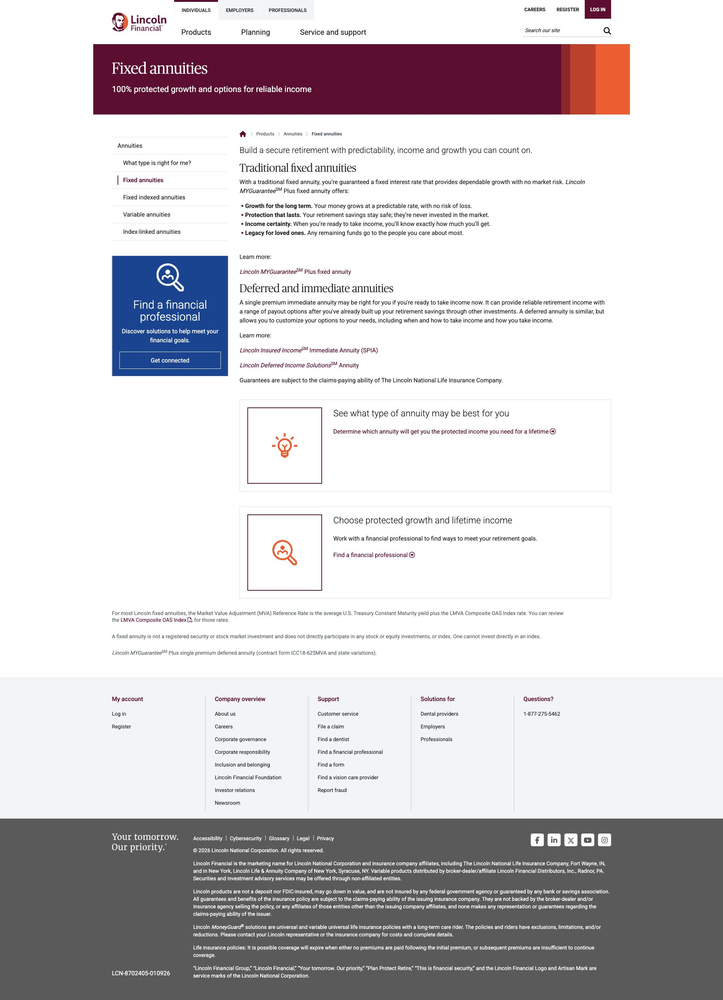

### 9.4 Icon/text callout

Several product and campaign layouts place an orange line icon in a large outlined square beside a text block. Other callouts are centered mini-features in a two- or three-column row. Keep the icon's visual lightness, generous white area, and compact sans-serif heading. These are support elements, not heavily colored marketing cards.

### 9.5 Buttons and links

| Variant | Recipe based on observed appearance |
|---|---|
| Primary hero CTA | Burgundy fill, white label, square corners, 1px matching boundary, padding 12px32px; desktop about 50px high |
| Outline card CTA | White, burgundy label and 1px visible edge, padding 10px25px; about 44px high |
| Text link | Burgundy, compact sans-serif; use underline/focus affordance appropriately |
| Decision-tree choice | Blue fill, white uppercase label, square rectangle; use separate template-specific blue |
| Back-to-top | Black square, approximately 50px, white upward chevron; observed after scrolling |

Hover/pressed colors for every variant were not captured. Derive states from the chosen primary color and verify contrast; label these states as implementation choices. Do not invent a source-exact darker hex from a screenshot.

## 10. Tools directory and category selection

### 10.1 Desktop

After the stripe hero and breadcrumb, use a two-part main area:

- Left category navigation occupies approximately one quarter of inner width, around 334px.
- Right card grid occupies three quarters, around 1002px, with three columns and 30px gutters; card width about 300.7px.
- Category items are rectangular muted-gray rows, approximately 64px high, with 10px gaps.
- Active category is white with a burgundy left bar approximately 5px and fine gray boundaries; selected text is emphasized.
- Tool cards are pale-gray rectangles with a dark sans-serif title, short explanation, and a plus/launch affordance near the lower-right area.

**Observed interaction:** Selecting a category changed the visible tool set and URL fragment from `#financialwellness` to `#retirement`. The page scrolled so the header was outside the viewport. Treat categories as navigation/selection with a persistent active state.

**Important:** A clicked calculator plus opened an external calculator in a new tab. It was not an accordion expansion. Do not interpret the plus icon as proof of inline expansion. A new directory can use a clearer external-launch label while retaining the card's geometry.

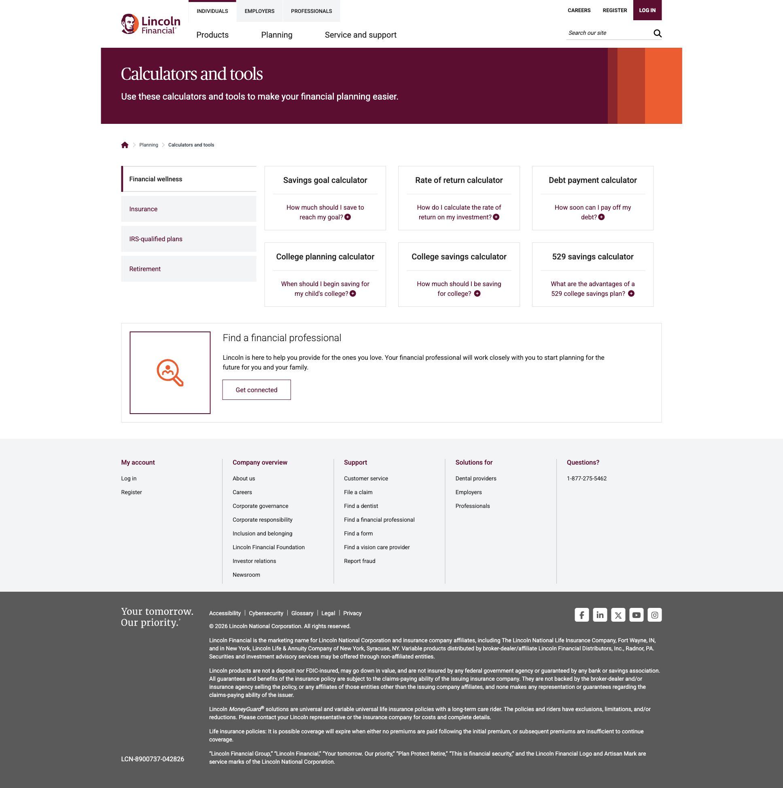

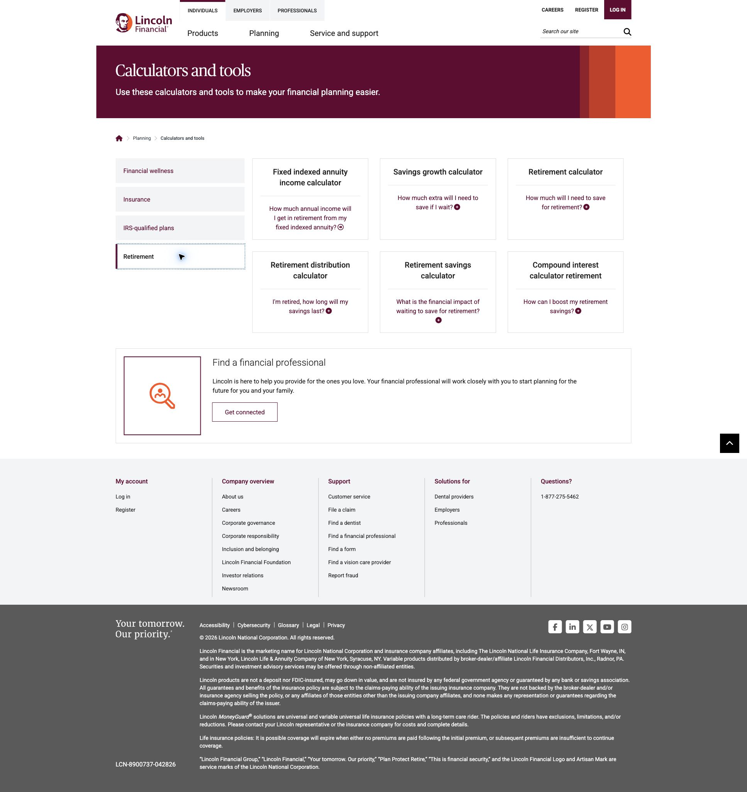

### 10.2 Compact layout

Category choices move above the cards and remain visible as a stacked list. They do not become a select element. At 390px they are 360px wide and about 50px high, separated by 10px. Active selection is a white bordered row; the prominent desktop left bar is not visible in the same way.

Tools stack one per row, full 360px width, with generous separation. Preserve card title/body/launch alignment and allow height to follow content. The captured mobile tools page is 4419px tall, demonstrating the intended long-page rhythm.

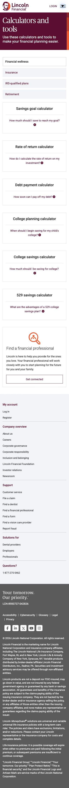

## 11. Support, forms, and decision trees

### 11.1 Support search hub

This template starts with breadcrumbs and a custom montage/collage around the centered heading. The heading sits on a translucent white backing with 8px radius; the background is made from photography and geometric color accents. Replace that montage with original imagery. Keep the centered search as the primary affordance.

Measured desktop search: **700 × 42px**, 2px `#5A5A5A` border,10px radius,16px text. Below it, suggested query chips have fine gray outlines, rounded corners, and compact height around 34px. They wrap into multiple centered lines. Five topic tiles follow, each with orange icon, brief label, and fine border. A lower popular-links section uses ordinary burgundy links organized in columns.

At 390px, search is **324px wide at x33**, still 42px high and 10px radius. Montage and title reflow vertically. Chips wrap naturally. Topic tiles become horizontal rows with an icon at the left and text beside it, rather than retaining five tiny columns.

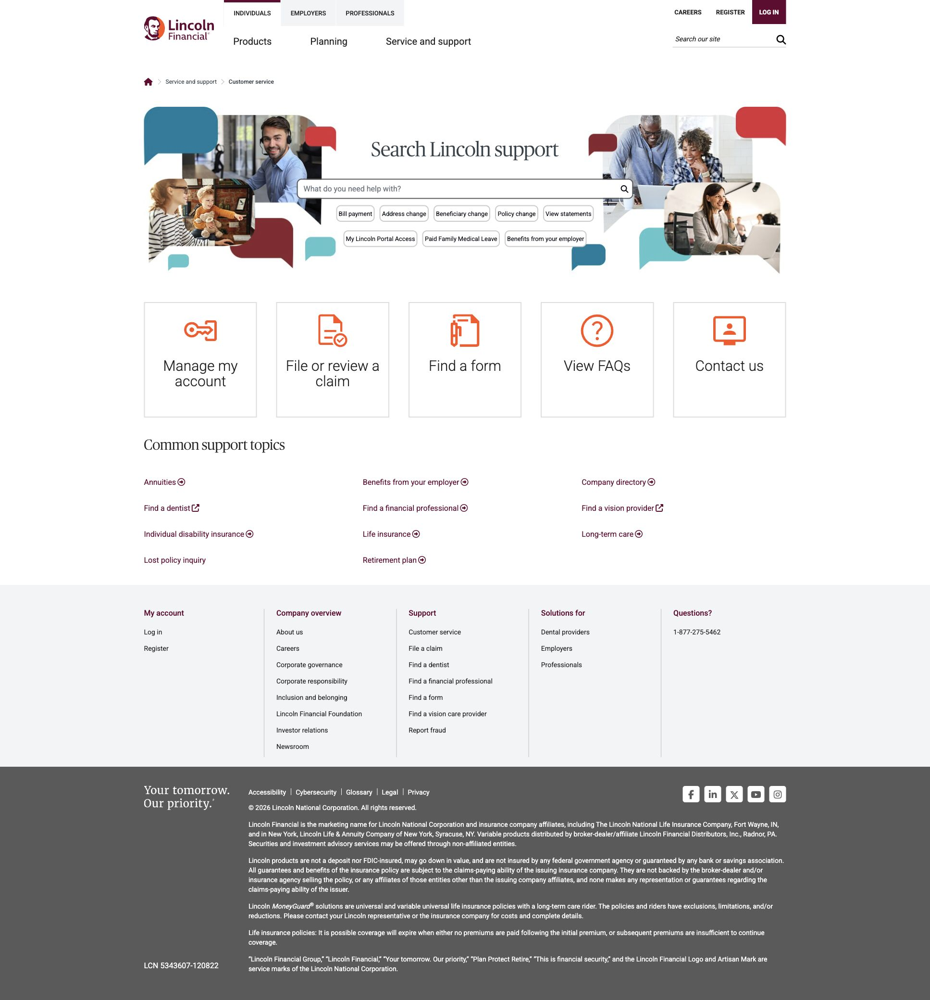

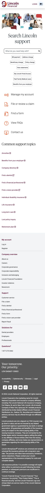

Search submission, result ranking, empty results, and error states were not audited. They require new product behavior and content.

### 11.2 Inquiry form

The professional-inquiry page uses a plain content title rather than a large photo hero. Breadcrumbs precede the 42/48 display H1. Form occupies the left half of main content; original montage/illustration fills the right side. Replace the illustration completely while keeping its visual area and alignment.

Measured form fields:

- Left form area around 653px wide.
- Paired inputs 321.5px each, with 10px gap.
- Inputs 42px high,2px dark-gray border,0px radius,16px text, padding 6px10px.
- Full-row selects span the form area when required.
- Visible labels remain above fields, not solely inside placeholders.
- Explanatory/consent copy precedes a square burgundy submit button.
- Fine-print content sits below the main form.

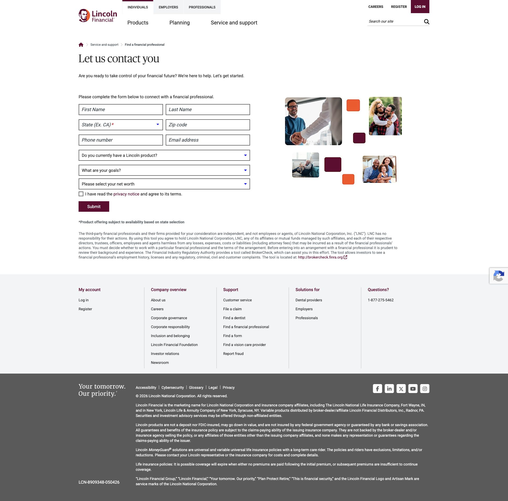

No field was filled and no form was submitted. Required-field errors, success confirmation, validation timing, and compact form layout are **unverified**. Recipe: stack paired fields on phone, retain 42px field height, associate labels/errors programmatically, and reserve enough vertical room for errors without overlap.

### 11.3 Decision-tree chooser

The claim tool is a separate plain-white template: breadcrumb, large serif page title, then a question/options region beside an illustration. Question heading is around 30/32 lightweight serif. Choices are square blue buttons with white uppercase labels. Illustration sits on the right with substantial white space.

The initial choice was clicked to reveal a follow-up question with **Yes**, **No**, and **Back** controls. The route remained the same. This confirms an in-page branching decision tree, not a submitted claim. The screenshots show both initial and subsequent state.

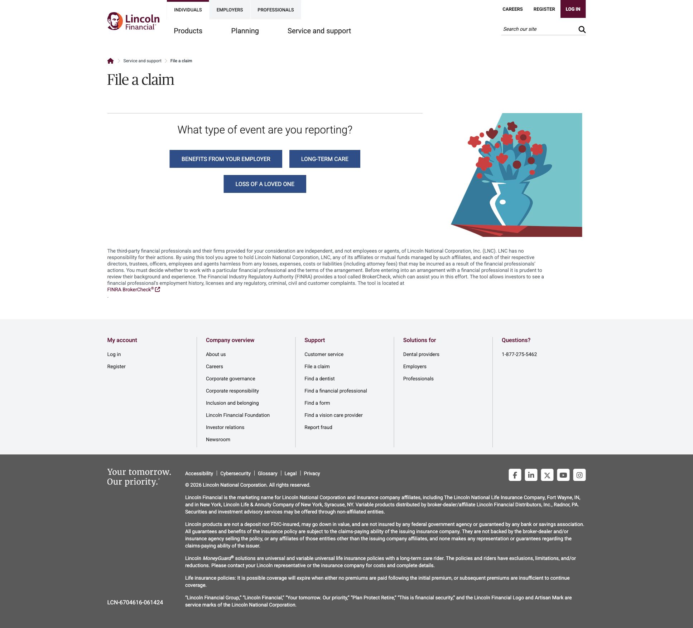

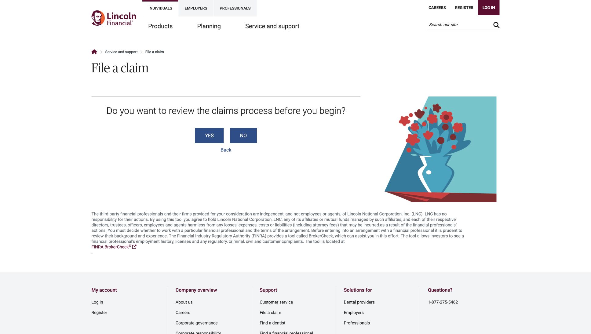

Use this pattern for a new site's own guided chooser. Replace the question wording, decision logic, destination URLs, and illustration. Avoid carrying source insurance-specific instructions into an unrelated business. Focus should move to the new question and Back should restore the preceding state; these are implementation recommendations.

## 12. Footer

### 12.1 Light directory

The footer directory spans the viewport in `#F2F4F6`, while its content aligns to the main container. Wide desktop uses five columns with thin vertical separators. Top padding is approximately 50px and lower padding 20px. Column headings use burgundy 16/16 medium-weight text; links are smaller sans-serif with loose readable line spacing.

Homepage capture: directory starts around y2311 and is approximately 378px high. This is content-dependent. The page includes 40px separation before the directory.

On phone, all five sections are stacked and expanded. No footer accordion was observed. Keep their hierarchy and separation; the reference mobile directory is approximately 1064px high.

### 12.2 Dark legal region

Below the directory, a full-width `#5A5A5A` region holds:

- A small left identity/tagline slot, replaced by the new organization's own identity.
- A broad right area of small white legal paragraphs,14/20.
- A row of compact social icons.
- Modest paragraph separation and 40px top/bottom padding.

Measured homepage desktop: y2689, approximately 485px high; left identity area around 177 × 50px, right text region starts after 40px horizontal separation. On mobile the identity and text stack, with approximately 40px between; the reference's long legal copy produces a region around 1144.5px high.

Do not pad a new site's footer to match these heights if its legal text is shorter. Match surface, alignment, type, and spacing, then supply accurate new legal content. Never copy the source's disclosures, regulatory statements, company relationships, trademark declaration, product guarantees, or copyright notice.

## 13. Page blueprints

Use these compositions to build new routes. Names below describe template roles, not recommended production product names.

| Template | Section sequence | Reference evidence |
|---|---|---|
| Audience homepage | Header → composite hero → overlapping 6-action strip →3 inset-copy cards → image/announcement feature →3 more cards → directory/legal footer | 01,17,18,24 |
| Product hub A | Header → burgundy split hero →4-action strip → brief intro → image/text feature → icon callout →3 supporting cards → disclosure text → footer | 03 |
| Product hub B | Header → burgundy/neutral/photo hero → topic actions → explanatory features and cards → disclosures → footer | 04 |
| Workplace hub | Header → white/photo split hero → action strip →3 broad supporting cards → footer | 05 |
| Employee-benefits hub | Header → white/photo split hero → short intro →3 topic image cards → footer | 26 |
| Investment hub | Header → burgundy/architecture hero →3 actions → editorial sections → centered icon features → bordered icon/text callouts → detailed disclosures → footer | 27 |
| Long-term planning hub | Header →420px photo hero with 360px inset panel → action strip → editorial copy and supporting features → footer | 28 |
| Tool directory | Header → shallow stripe hero → breadcrumb → quarter-width category list + three-quarter 3-column tool grid → icon help CTA → footer | 06,21,29 |
| Support hub | Header → breadcrumb → montage/title/search → query chips →5 support tiles → link directory → footer | 08,23 |
| Inquiry page | Header → breadcrumb → title/intro → half-width paired-field form + illustration → fine print → footer | 09 |
| Guided chooser | Header → breadcrumb → title → question/options + illustration → explanatory copy → footer | 10,11 |
| Article/detail | Header → stripe hero → breadcrumb → hierarchical sidebar + article → callouts/disclosures → footer | 14 |
| Company/editorial | Header → brand-history composite hero →6 quick actions → editorial sections →3 image/text feature columns → badge row → footer | 12 |
| Campaign/editorial | Header → panorama/inset panel → action strip → introduction → category/product sections →2-column features → resources/contact module → fine print → footer | 13 |
| Employer audience | Header with alternate active audience → photo hero → action strip → long sequence of editorial and card modules → footer | 15 |
| Professional audience | Header with alternate active audience → panoramic hero → professional resources and promotional modules → footer | 16 |

For company pages, replace the source founding year, portrait/history art, awards, rankings, and badges with genuine information belonging to the new organization. Use the same horizontal feature/badge rhythm only when there is equivalent real content.

The campaign page's long disclosure and editorial density is not necessary on every route. Use the template family appropriate to the new content; the consistency comes from containers, type, image framing, border treatment, and footer.

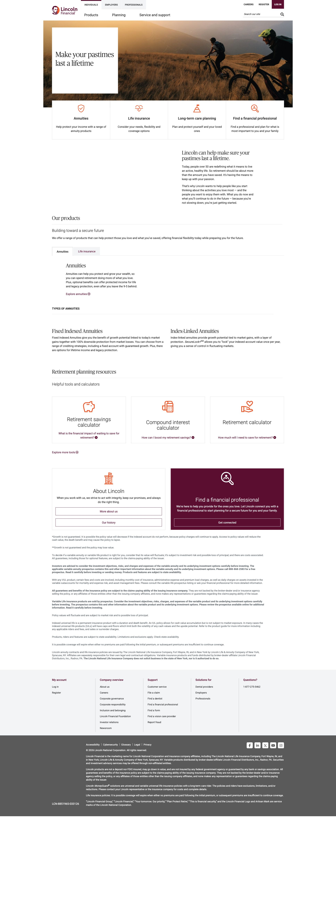

## 14. Interaction and accessibility

Separate confirmed behavior from new implementation requirements.

| Element | Confirmed evidence | New implementation requirement / uncertainty |
|---|---|---|
| Desktop product navigation | Open dropdown screenshot | Full keyboard, escape, click-away behavior not audited |
| Mobile navigation | Compact closed header captured | Open panel unverified; design accessible panel separately |
| Tools category | Selected category changes content and fragment | Preserve active state on direct link/reload; manage focus/scroll intentionally |
| Tool plus | External calculator opened in new tab | Provide descriptive accessible launch name; indicate external destination |
| Claim chooser | Next question and Back control visible after choice | Full branch tree/back semantics not audited |
| Search | Search UI and suggestions visible | Results/loading/error behavior unverified |
| Inquiry form | Empty/default appearance captured | Validation, submission, and success behavior unverified |
| Back-to-top | Visible square control after scrolling | Threshold and scroll animation unverified |
| Footer | Expanded stacked phone sections | Do not add an accordion solely for brevity |

Recipe for accessibility while preserving appearance:

- Provide semantic header/nav/main/footer landmarks and visible-on-focus skip links.
- Keep heading levels coherent; do not copy a source H2-as-hero quirk when it harms hierarchy.
- Use links for navigation, buttons for state changes.
- Provide clear focus states with sufficient contrast; preserve the fine dotted style where feasible.
- Maintain practical touch targets of at least 44px for new controls. Small utility text can sit within a larger hit area.
- Add meaningful alternative text to new informative images; hide decorative stripes and icons from assistive technology when adjacent text already provides the name.
- Do not rely only on burgundy/orange to signal selected state; use weight, boundary, and semantic state.
- Announce newly loaded decision questions and form errors appropriately.
- Respect reduced motion and avoid layout shifts during image/font loading.
- Verify contrast against actual new background imagery, especially light serif text on photos or composite panels.

These are handoff requirements, not a claim that the source passed an accessibility audit.

## 15. Asset replacement and content rules

### 15.1 Mandatory replacement matrix

| Source material | Action for new site | What may be preserved in the design recipe |
|---|---|---|
| Organization names and namesake | Replace everywhere, including metadata, alt text, URLs, footer, and structured data | Name placement, typographic role, slot size |
| Logo, portrait, silhouette, monogram | Use a wholly new logo belonging to the new organization | Header/footer alignment and approximate occupied area |
| Taglines and slogans | Write original wording | Short headline structure and display hierarchy |
| Trademarked product names / symbols | Remove and use new site's actual offerings | Product grid and navigation architecture |
| Campaign title and creative identity | Replace campaign name, visual, and copy | Inset-panel hero composition and long editorial layout |
| Photographs / montages / illustrations | Own or separately license replacements | Aspect ratio, subject placement, color temperature, crop density |
| Orange SVG icons | Redraw or obtain an independent icon set | Size, fine-line style, semantic role, orange accent |
| Branded curves / distinctive identity art | Create independent decorative geometry; never trace a mark | Broad asymmetry, panel/curve relationship, spatial balance |
| Awards, badges, ratings, rankings | Omit or replace with substantiated new credentials | Row spacing if equivalent genuine content exists |
| Fonts | Obtain an independent license or use a licensed alternative | Weight, hierarchy, approximate metrics |
| Marketing copy, testimonials, announcements | Write original business-specific content | Line counts, content density, paragraph rhythm |
| Legal text and regulatory disclosures | Supply accurate new organization's text | Fine-print typography and footer organization |
| Social marks | Use permitted official platform assets for real new accounts | Icon size and horizontal alignment |
| Source CSS/JavaScript | Implement original components/styles | Measured layout values and interaction patterns |
| Screenshots and evidence files | Keep in internal research documentation only | Visual comparison during design review |

### 15.2 Original image art direction

For lifestyle heroes, favor warm natural light, calm outdoor or home settings, people positioned to one side, and broad negative space for text. Use ordinary, believable scenes rather than overly stylized illustrations. For institutional/investment content, use architectural depth and orderly geometry. For editorial cards, use broad landscape crops with an identifiable human or environmental subject.

Maintain source aspect ratios with new images. Use `object-fit: cover` when cropping and set `object-position` intentionally. Provide mobile crops where the main subject would disappear in a narrow slice. Do not stretch imagery or use the reference screenshot as a background.

### 15.3 Production exclusion check

Search final production files and rendered metadata for source organization names, trademarks found in the evidence inventory, original asset domains, original contact details, and screenshot filenames. Check logo alt text, Open Graph images, favicons, JSON-LD, footer copyright, product descriptions, downloaded PDFs, and CSS font/image URLs. The research package is expected to contain source names; the production site is not.

A useful deployment boundary is to keep all `docs/design-reference/` material outside public assets and exclude it from the deployed site bundle. The supplied screenshots should never become a page users see.

## 16. Implementation handoff

### 16.1 Suggested component inventory

Implement an original reusable library with these responsibilities:

| Component | Inputs / variants | Key constraint |
|---|---|---|
| `SiteHeader` | Own identity, audience links, utilities, main nav |118/104px desktop evidence;70px compact |
| `NavigationDropdown` | Grouped links, active parent |Fine border, restrained flyout |
| `Hero` | Composite / split / inset / stripe, own image, headline, CTA |Separate hero max-width from content width |
| `QuickActions` |4–6 items, original icons |−40px desktop overlap; stacked compact rows |
| `InsetImageCard` |Image, heading, body, CTA |20px side inset and 20px overlap |
| `EditorialFeature` |Image, heading, copy/list |Broad two-column desktop, stacked compact |
| `ToolDirectory` |Categories, active hash, tool cards |Quarter/three-quarter layout, real launch links |
| `SupportSearch` |Title, query, suggestions, own montage |700px desktop search;10px radius exception |
| `TopicTiles` |Icon, label, link |Horizontal row form on compact layouts |
| `InquiryForm` |Schema, labels, validation, own illustration |42px square fields,10px paired gap |
| `GuidedChooser` |Questions/options/history, own illustration |Explicit state model and Back |
| `ArticleLayout` |Sidebar tree, article, callouts |25/75 desktop split |
| `SiteFooter` |Directory groups, own legal/social content |Light directory + dark legal surface |

### 16.2 Neutral starter assets

The accompanying [tokens.css](tokens.css) is newly written, not copied source CSS. It implements container breakpoints, neutral type tokens, a starter card, basic buttons, quick-action geometry, and the directory/footer shell. It intentionally does not include source fonts, logos, images, copy, backend integrations, or unverified mobile-menu behavior.

Its `ReferenceDisplay` font family is a local implementation placeholder. Add your own licensed font face. The temporary Georgia fallback will differ from Publico. Its quick-action rules model the measured homepage; apply page-specific variants for other strip heights.

Illustrative neutral markup:

```html
<header class="site-header"><!-- New organization's own identity/navigation --></header>
<main id="main-content">
  <section class="hero-shell" aria-labelledby="hero-title">
    <!-- Original image/composite with the measured placement -->
    <div class="hero-copy">
      <h1 id="hero-title">A clear path to your next chapter</h1>
      <a class="button button--primary" href="/planning">Explore your options</a>
    </div>
  </section>
  <div class="content-container">
    <nav class="quick-actions" aria-label="Popular services"><!-- Own links/icons --></nav>
    <section class="card-grid" aria-label="Featured resources">
      <article class="image-card">
        
        <div class="image-card__panel">
          <h2>Prepare for what comes next</h2>
          <p>Use original copy that fits this compact editorial panel.</p>
          <a class="button button--outline" href="/resources">View resources</a>
        </div>
      </article>
    </section>
  </div>
</main>
<footer><!-- New directory and accurate new legal text --></footer>
```

This snippet is an implementation starting point, not a finished reproduction. Match the chosen hero family's responsive image/text composition separately.

### 16.3 Fidelity sequence

1. Build header, hero width, main container, grid, and footer surfaces.
2. Load an independently licensed display/sans pair and match type metrics.
3. Reproduce quick-action overlap and card-panel inset before adding content.
4. Insert original copy with comparable line counts and new images with matched aspect ratios.
5. Tune photo crops and subject placement at 1935,1080,768,390px.
6. Implement category/chooser/form behaviors with new routes and business logic.
7. Compare matched viewport screenshots; fix alignment/spacing before tiny decorative details.
8. Run identity and asset exclusion checks on production output.

## 17. Visual acceptance criteria

These checks describe the source-faithful reference profile. For an app rebuild, Section 0 mobile acceptance criteria override source measurements, including 16px body,48px controls, shorter workflow titles, and a compact app footer.

### Layout and type

- [ ] 1935px hero is 1436px wide and centered; main outer container is 1366px with 15px inner padding.
- [ ] Hero text edge aligns with content at wide desktop where the family specifies 50px hero padding.
- [ ] 1080px version uses 960px content container and the observed compressed header.
- [ ] 768px version has compact 70px header and single-column promotional cards.
- [ ] 390px body has 15px outer content gutters and no horizontal page overflow.
- [ ] Homepage/tools hero display text keeps the observed 42/48 metrics on phone.
- [ ] Body type is 16/24 desktop and 15/22.5 phone; legal 14/20 remains visually secondary.
- [ ] Display serif is lightweight; card headings are lightweight sans-serif rather than serif by default.
- [ ] Hero/photo copy remains readable after new image replacement.

### Components and rhythm

- [ ] Homepage action strip overlaps desktop hero by 40px and has no card shadow.
- [ ] Compact quick actions become full-width icon/text rows.
- [ ] Card images have broad landscape proportions; copy panels inset 20px and overlap 20px.
- [ ] Desktop card CTAs align across a row; mobile panels grow naturally with copy.
- [ ] Normal controls remain square; rounded support-search exceptions stay local.
- [ ] Three-column desktop cards use 30px gaps.
- [ ] Tools selected state is clear and URL/hash can restore it.
- [ ] Tool launch affordances do not misleadingly act as unimplemented accordions.
- [ ] Footer has light directory followed by dark legal area; mobile sections are stacked and expanded.

### Function and identity

- [ ] Keyboard access, visible focus, semantic landmarks, labels, and original image alt text are present.
- [ ] New navigation and CTA links resolve to the new site's own destinations.
- [ ] Form and guided chooser behaviors use new business logic and tested states.
- [ ] Reduced-motion preference is honored; font/image loading does not shift major layout.
- [ ] Every logo, branded visual, badge, photo, icon, font, and text asset has an appropriate independent origin.
- [ ] No source name, mark, slogan, product trademark, copyright, contact data, source-domain asset URL, or source screenshot appears in the production site.
- [ ] Reference-only artifacts are excluded from public deployment.

Use a 1–2px alignment tolerance for stable large elements at the same desktop viewport, and compare line breaks separately from image content. This tolerance is a review target, not a measured guarantee. Do not compare full-page height as an invariant after changing copy or legal disclosures.

## 18. Screenshot and evidence index

The gallery links every full-resolution capture, corresponding JSON/text evidence where available, viewport dimensions, and original URL. Full-page screenshots are deliberately long; open the original image for inspection rather than rely on a scaled Markdown preview.

| ID | Capture | Viewport | Purpose |
|---|---|---|---|
|01|Individuals homepage|1935 ×1094|Primary desktop system, cards, announcements, footer|
|02|Products dropdown|1935 ×1094|Visible navigation open state; screenshot-only|
|03|Annuity hub|1935 ×1094|Burgundy split hero and product modules|
|04|Life insurance hub|1935 ×1094|Alternate split/composite hero|
|05|Workplace plan hub|1935 ×1094|White/photo split hero|
|06|Tools, initial category|1935 ×1094|Stripe hero, category rail,3-column tools|
|08|Customer support|1935 ×1094|Montage, search, chips,5 support topics|
|09|Professional inquiry|1935 ×1094|Paired-field form and illustration|
|10|Claim chooser, initial|1935 ×1094|Question/options layout|
|11|Claim chooser, next step|1935 ×1094|Viewport-only branch state, Yes/No and Back|
|12|Company overview|1935 ×1094|History/editorial features and badges|
|13|Campaign page|1935 ×1094|Long editorial template; selected hash state|
|14|Product detail|1935 ×1094|Sidebar/article and blue callout|
|15|Employer audience|1935 ×1094|Alternate audience landing composition|
|16|Professional audience|1935 ×1094|Alternate audience/resources composition|
|17|Homepage, narrower desktop|1080 ×633|Compressed header and full-width hero|
|18|Homepage, phone full page|390 ×844|Stacked composition and full footer|
|19|Homepage, phone viewport|390 ×844|Readable first-screen reference; screenshot-only|
|21|Tools, phone|390 ×844|Categories above stacked tools|
|22|Annuity hub, phone|390 ×844|Product responsive composition|
|23|Support, phone|390 ×844|Search/chips and horizontal topic rows|
|24|Homepage, tablet|768 ×844|70px header; stacked cards at tablet width|
|25|Homepage, desktop viewport|1080 ×633|Readable first-screen reference; screenshot-only|
|26|Employee benefits|1935 ×1038|White/photo hero and 3 topics|
|27|Investments|1935 ×1038|Architecture hero and dense editorial sections|
|28|Long-term planning|1935 ×1038|420px hero /360px inset panel|
|29|Tools, retirement selected|1935 ×1038|Confirmed alternate selection/hash and scroll|

IDs are retained from capture order; missing IDs are discarded unsuccessful/redundant captures, not missing deliverables. The manifest contains 24 measured states; the three extra screenshots 02/19/25 supplement them. Captures show one browser/session/date. Geolocation, personalization, experiments, and future website updates can change the reference.

**Uncaptured areas:** authenticated accounts, complete calculator third-party applications, search result states, full form/claim submission workflows, every dropdown/hover/error state, and the expanded mobile menu. The spec does not claim source-exact behavior for those areas.

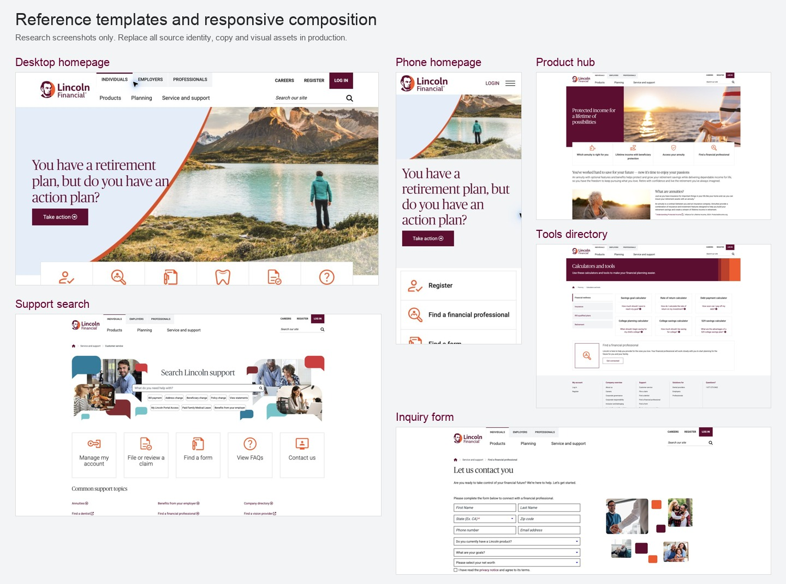
